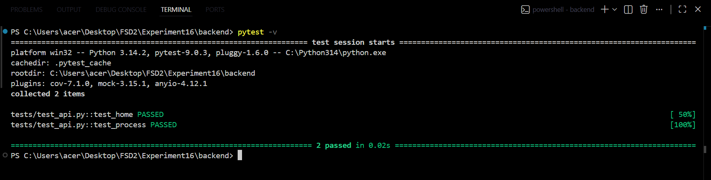
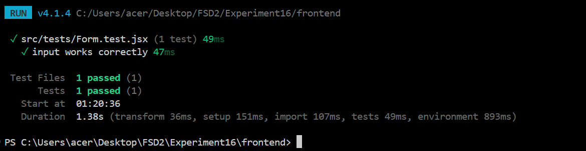
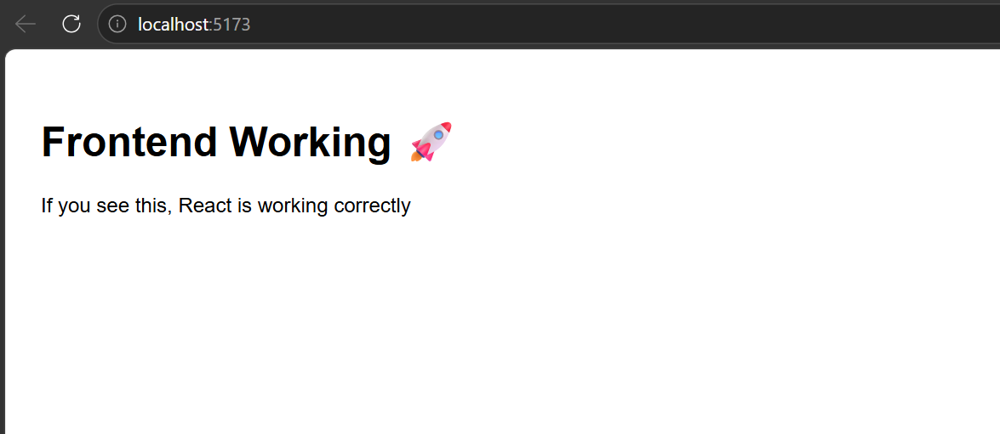
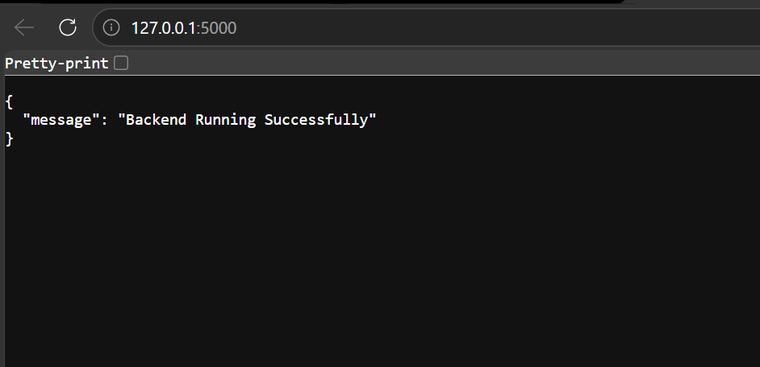

#  Experiment16 (23BIS70052 - PRAJJWAL KANDPAL)— Perform unit testing for frontend/backend modules

A full-stack web application demonstrating API development and testing using **Flask** (backend) and **React** (frontend), with **pytest** for backend testing and **Vitest** for frontend testing.

---

##  Project Structure

```
Experiment16/
├── backend/
│   ├── app.py                  # Flask API
│   ├── requirements.txt        # Python dependencies
│   └── tests/
│       └── test_api.py         # pytest test cases
├── frontend/
│   ├── src/
│   │   ├── components/
│   │   │   └── Form.jsx        # React UI form
│   │   ├── tests/
│   │   │   └── Form.test.jsx   # Vitest test cases
│   │   ├── App.jsx
│   │   └── main.jsx
│   ├── index.html
│   ├── vite.config.js
│   └── package.json
├── .gitignore
└── README.md
```

---

## Tech Stack

| Layer | Technology |
|-------|-----------|
| Backend | Python, Flask, Flask-CORS |
| Frontend | React, Vite |
| Backend Testing | pytest |
| Frontend Testing | Vitest, React Testing Library |
| Deployment (Backend) | Render |
| Deployment (Frontend) | Netlify |

---

## Getting Started (Local Setup)

### Prerequisites
- Python 3.x
- Node.js 18+
- npm

---

###  Backend Setup

```bash
cd backend
pip install -r requirements.txt
python app.py
```

Backend runs at: `http://127.0.0.1:5000`

#### API Endpoints

| Method | Endpoint | Description |
|--------|----------|-------------|
| GET | `/` | Health check — returns running status |
| POST | `/process` | Accepts `{ name }` JSON, returns uppercase, length, status |

#### Example Request & Response

```bash
POST /process
Body: { "name": "lucifer" }

Response:
{
  "original": "lucifer",
  "upper": "LUCIFER",
  "length": 7,
  "status": "processed"
}
```

---

###  Frontend Setup

```bash
cd frontend
npm install
npm run dev
```

Frontend runs at: `http://localhost:5173`

---

##  Running Tests

### Backend Tests (pytest)

```bash
cd backend
pytest -v
```

#### Screenshot — pytest Output
>  _Replace with your screenshot_
> 

#### What is tested:
- `test_home` — checks `/` route returns 200 and correct message
- `test_process` — checks `/process` route correctly uppercases name and returns length

#### How pytest tests the API:
Flask's built-in **test client** simulates HTTP requests without starting the actual server. This means:
- No browser needed
- No port conflicts
- Runs anywhere instantly

```python
client = app.test_client()        # fake browser
res = client.post("/process", json={"name": "lucifer"})
assert res.json["upper"] == "LUCIFER"   # verifies response
```

---

### Frontend Tests (Vitest)

```bash
cd frontend
npx vitest run
```

#### Screenshot — Vitest Output
>  _Replace with your screenshot_
> 

#### What is tested:
- `input works correctly` — renders the form, types in the input, verifies value updates

---

##  Application UI

#### Screenshot — React Frontend
>  _Replace with your screenshot_
> 

#### Screenshot — Backend API Response
>  _Replace with your screenshot_
> 

---

##  Deployment

### Backend → Render

1. Push code to GitHub
2. Go to [render.com](https://render.com) → New Web Service
3. Connect GitHub repo
4. Set:
   - **Root Directory:** `backend`
   - **Build Command:** `pip install -r requirements.txt`
   - **Start Command:** `gunicorn app:app`
5. Deploy

Live URL: `https://two3bis70052experiment16fsd2.onrender.com`

---

### Frontend → Netlify

1. Update API URL in `Form.jsx` to your Render backend URL
2. Go to [netlify.com](https://netlify.com) → Add new site
3. Connect GitHub repo
4. Set:
   - **Base directory:** `frontend`
   - **Build command:** `npm run build`
   - **Publish directory:** `frontend/dist`
5. Deploy

Live URL: `23bis70052-experiment16-fsd2.netlify.app`

---

##  Test Results Summary

| Test | Tool | Status |
|------|------|--------|
| `test_home` | pytest |  Passed |
| `test_process` | pytest |  Passed |
| `input works correctly` | Vitest |  Passed |

---

##  How to Add Screenshots

1. Create a `screenshots/` folder inside `Experiment16/`
2. Take screenshots of:
   - `pytest -v` terminal output → save as `pytest_output.png`
   - `npx vitest run` terminal output → save as `vitest_output.png`
   - React UI at `http://localhost:5173` → save as `frontend_ui.png`
   - Browser at `http://127.0.0.1:5000/` → save as `backend_response.png`
3. Push to GitHub — screenshots will auto-render in this README

---

##  Author

**Experiment16** — Full Stack Development Lab  
Flask + React + pytest + Vitest
