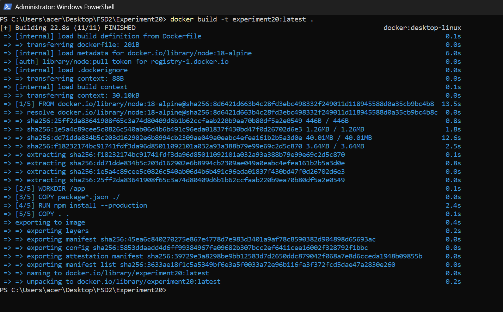
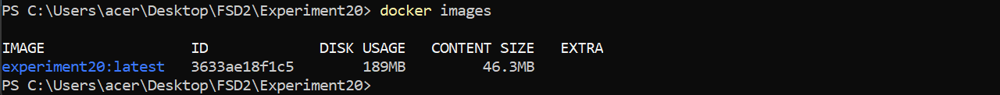
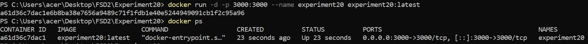
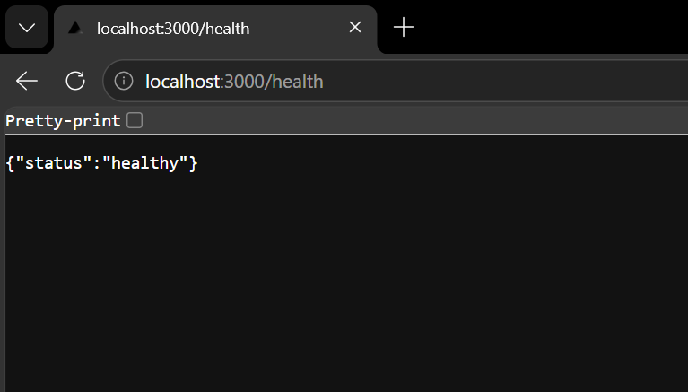
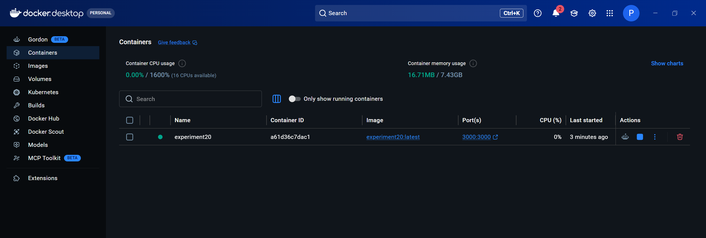
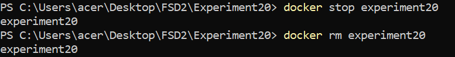
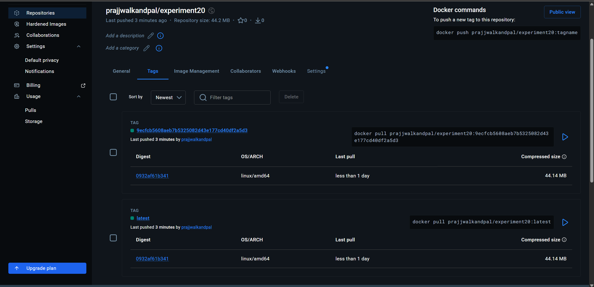
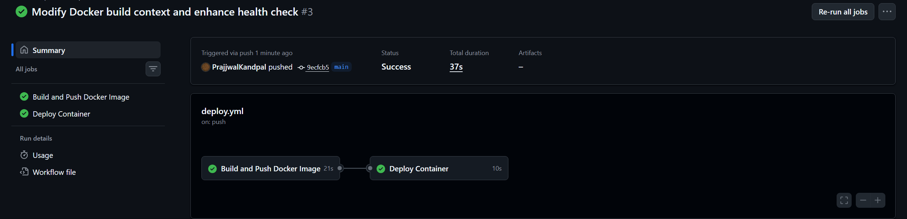

# Experiment 20 — Dockerized Node.js App with GitHub Actions CD Pipeline

## Objective

To containerize a Node.js Express backend application using Docker, push the image to Docker Hub, and automate the entire build-deploy lifecycle using a GitHub Actions CD Pipeline.

---

## Tech Stack

| Tool | Purpose |
|------|---------|
| Node.js + Express | Backend web server |
| Docker | Containerization |
| Docker Hub | Container image registry |
| GitHub Actions | CI/CD automation |

---

## Folder Structure

```
FSD2/
├── .github/
│   └── workflows/
│       └── deploy.yml          # GitHub Actions CD pipeline
│
└── Experiment20/
    ├── Dockerfile              # Docker image definition
    ├── .dockerignore           # Files excluded from Docker build
    ├── package.json            # Node.js project metadata & dependencies
    ├── package-lock.json       # Locked dependency versions
    └── index.js                # Express server with /health endpoint
```

---

## Application Code

### `index.js`
```javascript
const express = require('express');
const app = express();
const PORT = 3000;

app.get('/', (req, res) => {
  res.json({ message: 'Hello from Experiment 20!' });
});

app.get('/health', (req, res) => {
  res.status(200).json({ status: 'healthy' });
});

app.listen(PORT, () => {
  console.log(`Server running on port ${PORT}`);
});
```

### `Dockerfile`
```dockerfile
FROM node:18-alpine
WORKDIR /app
COPY package*.json ./
RUN npm install --production
COPY . .
EXPOSE 3000
CMD ["node", "index.js"]
```

### `.dockerignore`
```
node_modules
npm-debug.log
.git
.gitignore
```

---

## CD Pipeline — `deploy.yml`

The pipeline has **two jobs**:

### Job 1: Build and Push Docker Image
- Triggers on every push to `main`
- Checks out the code
- Sets up Docker Buildx
- Logs into Docker Hub using GitHub Secrets
- Builds and pushes the image with two tags:
  - `latest`
  - commit SHA (e.g., `9ecfcb5...`)

### Job 2: Deploy Container
- Runs after Job 1 completes
- Pulls the latest image from Docker Hub
- Runs it as a container on port 3000
- Performs a health check on `/health`
- Shows running containers via `docker ps`

```yaml
name: CD Pipeline - Experiment 20

on:
  push:
    branches: [ main ]
  pull_request:
    branches: [ main ]

jobs:
  build-and-push:
    name: Build and Push Docker Image
    runs-on: ubuntu-latest
    steps:
      - uses: actions/checkout@v4
      - uses: docker/setup-buildx-action@v3
      - uses: docker/login-action@v3
        with:
          username: ${{ secrets.DOCKER_USERNAME }}
          password: ${{ secrets.DOCKER_PASSWORD }}
      - uses: docker/build-push-action@v5
        with:
          context: ./Experiment20
          push: true
          tags: |
            ${{ secrets.DOCKER_USERNAME }}/experiment20:latest
            ${{ secrets.DOCKER_USERNAME }}/experiment20:${{ github.sha }}

  deploy:
    name: Deploy Container
    runs-on: ubuntu-latest
    needs: build-and-push
    steps:
      - name: Pull and run Docker container
        run: |
          docker pull ${{ secrets.DOCKER_USERNAME }}/experiment20:latest
          docker run -d -p 3000:3000 --name experiment20 \
            ${{ secrets.DOCKER_USERNAME }}/experiment20:latest
      - name: Health check
        run: |
          for i in {1..10}; do
            curl -sf http://localhost:3000/health && echo "Health check passed!" && exit 0
            sleep 3
          done
          exit 1
      - name: Show running containers
        run: docker ps
```

---

## GitHub Secrets Required

| Secret Name | Description |
|-------------|-------------|
| `DOCKER_USERNAME` | Your Docker Hub username |
| `DOCKER_PASSWORD` | Your Docker Hub access token |

> Go to: GitHub Repo → Settings → Secrets and variables → Actions → New repository secret

---

## Steps to Run Locally

```powershell
# 1. Navigate to project folder
cd FSD2/Experiment20

# 2. Build Docker image
docker build -t experiment20:latest .

# 3. Run the container
docker run -d -p 3000:3000 --name experiment20 experiment20:latest

# 4. Verify it's running
docker ps

# 5. Test the health endpoint
curl http://localhost:3000/health

# 6. Stop and remove when done
docker stop experiment20
docker rm experiment20
```

---

## Screenshots

### 1. Docker Build — Success
> `docker build -t experiment20:latest .` completed with 11/11 steps finished



---

### 2. `docker images` — Image Listed
> Confirms the image `experiment20:latest` was built locally (189MB disk, 46.3MB content)



---

### 3. `docker ps` — Container Running
> Container `experiment20` is UP on port `0.0.0.0:3000->3000/tcp`



---

### 4. Health Check in Browser
> Visiting `localhost:3000/health` returns `{"status":"healthy"}`



---

### 5. Docker Desktop — Container Dashboard
> Container `experiment20` visible and running in Docker Desktop UI



---

### 6. Docker Stop & Remove
> Container stopped and removed cleanly using `docker stop` and `docker rm`



---

### 7. Docker Hub — Image Pushed
> Two tags pushed to `prajjwalkandpal/experiment20`: `latest` and commit SHA tag (44.14 MB, linux/amd64)



---

### 8. GitHub Actions — Pipeline Success ✅
> Both jobs — **Build and Push Docker Image** (21s) and **Deploy Container** (10s) — completed with green checkmarks. Total duration: 37s.



---

## Learning Outcomes

1. **Docker Containerization** — Learned how to write a `Dockerfile` using a lightweight `node:18-alpine` base image, set a working directory, copy dependencies, install packages in production mode, and expose a port to package a Node.js app into a portable, reproducible container.

2. **Docker Hub as a Container Registry** — Understood how to create a Docker Hub repository, generate a personal access token, tag images with both `latest` and commit SHA identifiers, and push them to a remote registry to make them available across environments.

3. **GitHub Actions CD Pipeline** — Built a multi-job GitHub Actions workflow (`deploy.yml`) that automatically triggers on every push to `main`, separating concerns into a `build-and-push` job and a `deploy` job with a `needs` dependency between them.

4. **Secrets Management in CI/CD** — Practiced securing sensitive credentials (`DOCKER_USERNAME`, `DOCKER_PASSWORD`) using GitHub's encrypted repository secrets so they are never exposed in workflow logs or source code.

5. **Health Checks and Container Verification** — Implemented a `/health` endpoint in the Express app and used a retry-based `curl` loop in the pipeline to verify the container started correctly, reinforcing the importance of readiness checks in automated deployment workflows.
